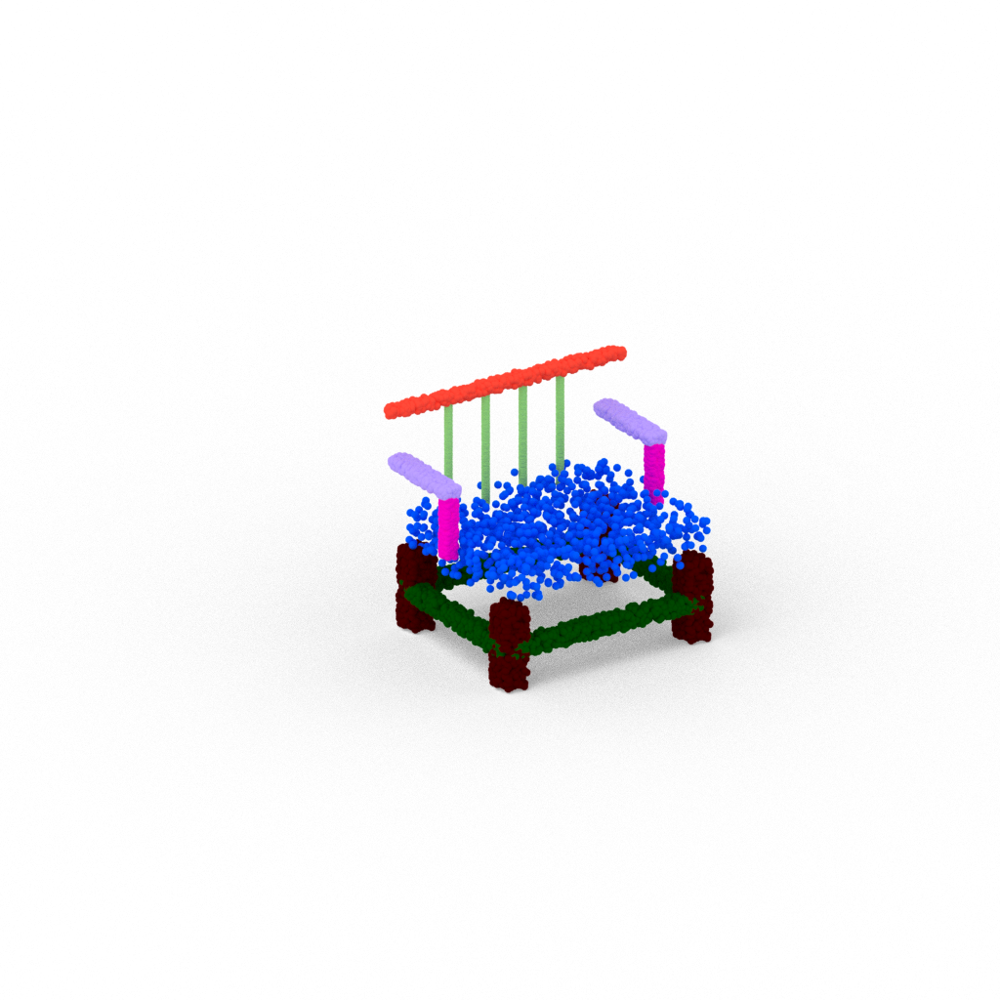
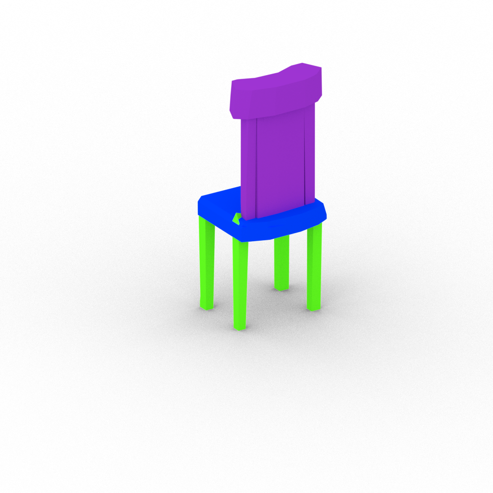
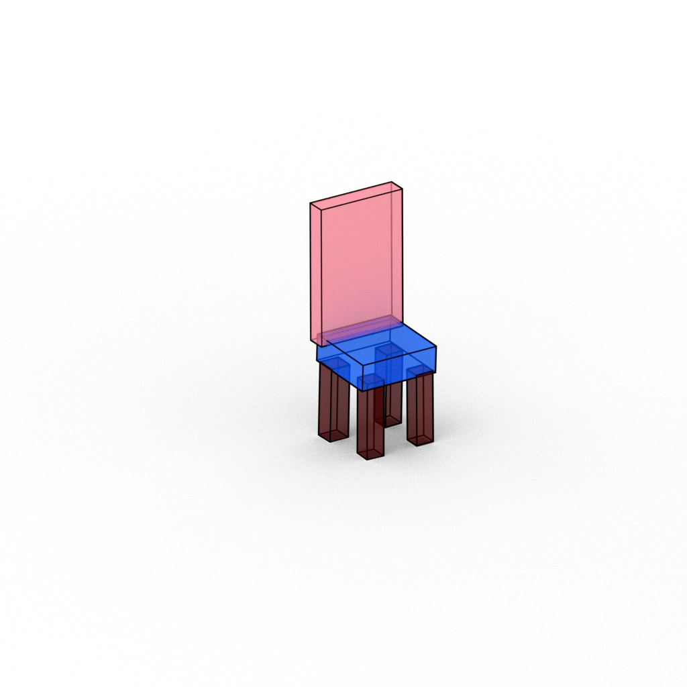
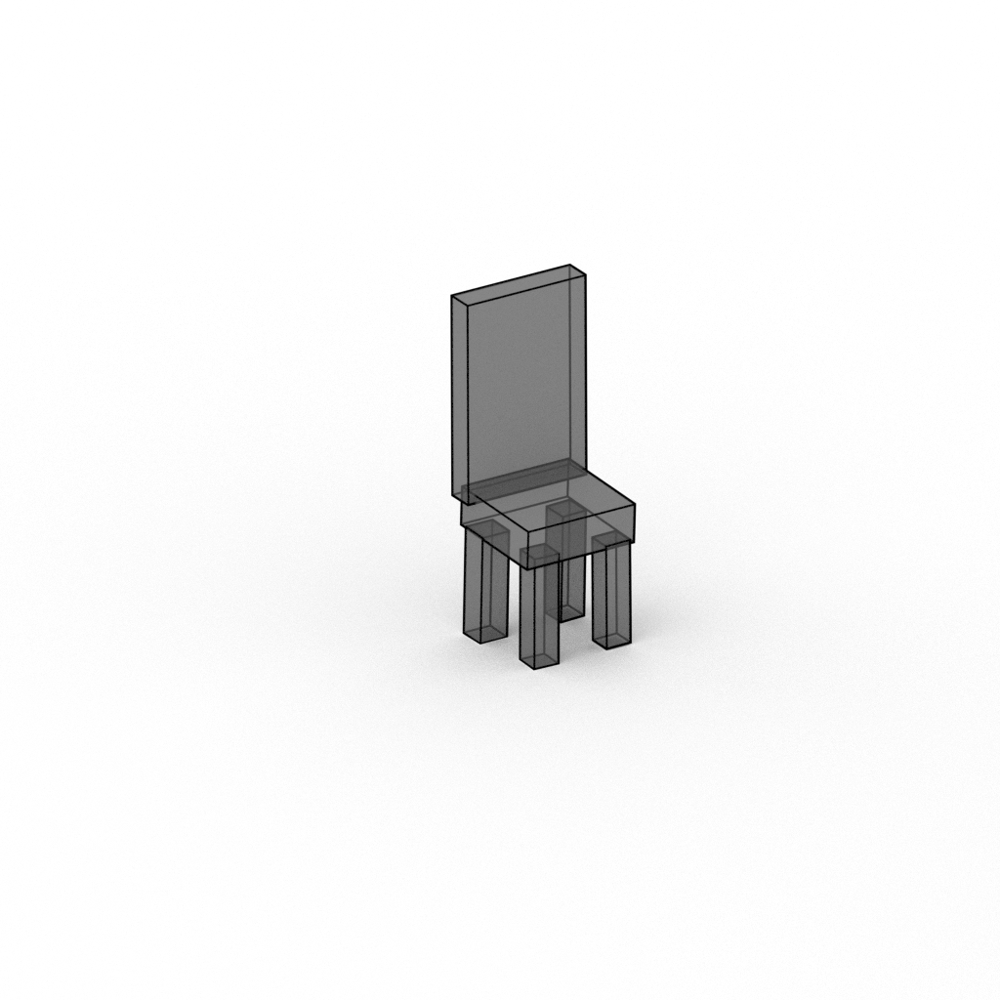

# Blender Rendering

Scripts for rendering meshes, pointclouds, structurenet-type box hierarchies w/ annotations ...etc.

Code was adapted from the visualization code in [the structurenet repo](https://github.com/daerduoCarey/structurenet).

Install latest version blender. The code here was used with `blender-2.93.4-linux-x64`. Make sure that at the end of installing blender, you can run blender by typing "blender" in your terminal

## Pointcloud rendering
Takes in a path to a folder with two files: `pts.txt` and `colors.txt`. Both txt's should have the same number of lines (the number of points in your pointcloud). Each line in pts.txt is an xyz coordinate, space-separated. Each line in colors.txt is an rgb value, space-separated.

`bash scripts/render_one_pointcloud.sh`

## Mesh rendering
Takes in a .obj, and a colors.txt that gives the space-separated rgb values for every vertex (as they appear in the .obj), space separated.

`bash scripts/render_one_mesh.sh`

    

## Bounding box rendering with colors corresponding to semantic colors
This graphs out a (structurenet)[https://github.com/daerduoCarey/structurenet] json representation of object part hierarchies.
`bash scripts/render_one_boxshape_adddel.sh`

## Bounding box rendering with annotations
This graphs out a (structurenet)[https://github.com/daerduoCarey/structurenet] json representation of object part hierarchies, with nodes with `.annot` fields, containing lists of strings for the annotations.
`bash scripts/render_one_boxshape.sh`

