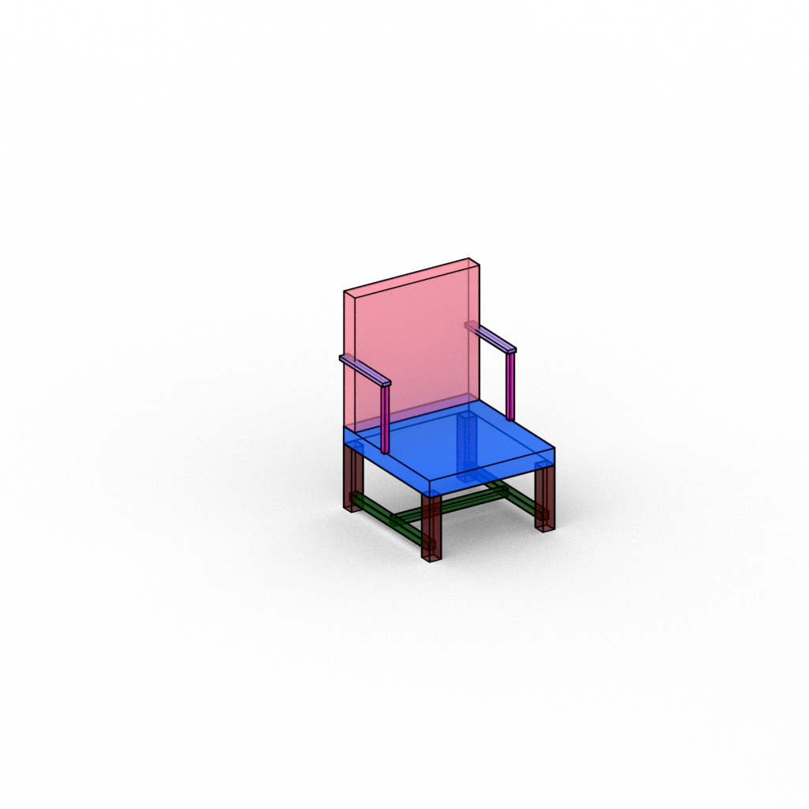
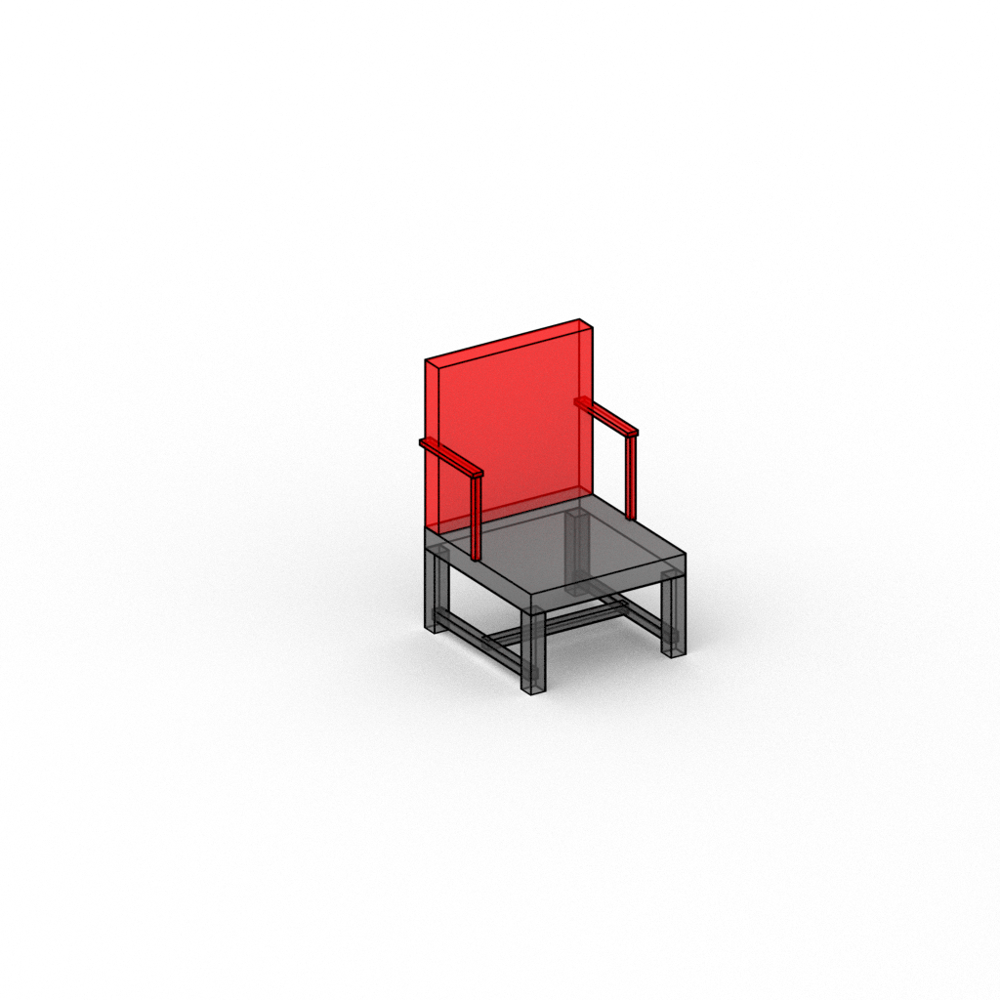

# Blender Rendering

Scripts for rendering meshes, pointclouds, structurenet-type box hierarchies w/ annotations ...etc.

Install latest version blender. The code here was used with `blender-2.93.4-linux-x64`. Make sure that at the end of installing blender, you can run blender by typing "blender" in your terminal

## Pointcloud rendering
`bash scripts/render_one_pointcloud.sh`

## Mesh rendering
`bash scripts/render_one_mesh.sh`

## Bounding box rendering with colors corresponding to semantic colors
`bash scripts/render_one_boxshape_adddel.sh`

## Bounding box rendering with annotations
`bash scripts/render_one_boxshape.sh`

